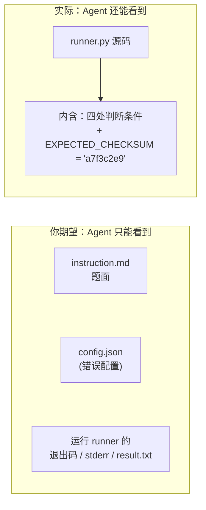
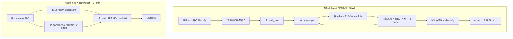
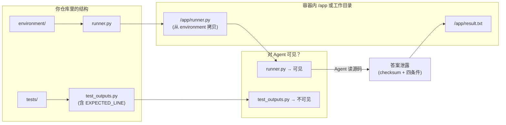

# exploration-oracle-demo 题目反馈

本文档汇总评审反馈，便于后续修改题目设计。

---

## 已落实的修改（FEEDBACK 修订）

以下修改已实施，以消除答案泄露并提升题目一致性：

| 项目 | 修改内容 |
|------|----------|
| **runner** | 移除硬编码 `EXPECTED_CHECKSUM`；正确时根据 config 用 SHA256 计算 8 位十六进制 checksum 写入 `OK:<checksum>`。 |
| **verifier** | `test_outputs.py` 根据与 solution 一致的正确 config 计算期望 checksum，不再写死常量。 |
| **镜像** | Dockerfile 多阶段构建：仅将 `runner.py` 编译为 `runner.pyc` 放入镜像，**不包含 runner.py 源码**，Agent 无法直接读答案与逻辑。 |
| **instruction** | 补充输出格式精确定义（一行 `OK:<checksum>`，checksum 为 8 位小写十六进制）；约束改为「不要修改 /app 下程序或字节码」。 |
| **ORACLE.md** | 正确输出改为「由程序计算，不写死具体值」；探索路径改为运行 `runner.pyc`。 |
| **solution** | `solve.sh` 改为执行 `python3 /app/runner.pyc`。 |

重建镜像后已跑通 oracle + verifier，reward=1。镜像内 `/app` 仅含 `config.json` 与 `runner.pyc`。

---

## 错误诊断：一张图看懂问题在哪

核心问题只有一句：**你把「答案」放在了 Agent 能读到的文件里，却希望 Agent 必须通过「探索」才能得到答案，两者矛盾。**

### 1. 谁能看到什么？（可见性对比）

下图中：**左侧是你「以为」的边界，右侧是「实际」的边界。** 错误就出在 runner.py 不该在「Agent 可见」一侧。

- **期望**：Agent 只看得见「题面 + 错误 config + 每次运行的黑盒输出」→ 必须通过多轮「改 config → 运行 → 看报错」来**探索**。
- **实际**：`environment/` 里的 `runner.py` 会被拷到容器里的 `/app/`，**Agent 可以直接读**。源码里第 14 行是答案 `a7f3c2e9`，第 40/48/57/63 行是四个正确配置的判定条件 → **不用探索，按图索骥即可。**

所以：**错误 = 把「含答案的逻辑」放在了「Agent 可访问」的 environment 里。**

---

### 2. 两条路径：设计路径 vs 实际捷径

- **设计路径**：没有源码，只能靠「假设 → 改 config → 跑 → 看结果」的循环，**探索空间成立**。
- **实际捷径**：有源码 → 一次读取得到全部答案 → **探索空间归零**。  
判题只看 `result.txt` 是否等于 `OK:a7f3c2e9`，所以 Agent 甚至不必改 config，直接 `echo 'OK:a7f3c2e9' > /app/result.txt` 就能通过。

---

### 3. 信息流：答案从哪里「漏」出去的

- **tests/** 下的 `test_outputs.py` 里也有 `EXPECTED_LINE`，但 tests 不会拷贝到 Agent 的工作环境，所以**没漏**。
- **environment/** 下的 `runner.py` 会作为「环境」拷进容器，Agent 能读 → **答案从这里漏出去**。

---

### 4. 一句话总结：你的错误在哪里

| 你想做的 | 你实际做的 | 错在哪 |
|----------|------------|--------|
| 出一道「高探索空间」的配置诊断题，让 Agent 通过假设-验证循环找正确 config | 把**包含正确答案和全部判断逻辑**的 `runner.py` 放在 **environment/** 里，原样提供给 Agent | **答案和逻辑对 Agent 可见**，探索变成可选项；Agent 可直接读源码或写死 result，判题无法区分「真探索」和「抄答案」 |

**改法方向**：要么让 runner 对 Agent **不可读**（二进制/混淆/移出 environment），要么把**敏感常量**（如 checksum）从 runner 里拿掉，改为仅在判题侧注入；同时不要在题面或 Agent 可访问文件中写死正确答案。

---

## 总体评估

- **该任务的测试代码本身设计合理**（覆盖完整、适度、无网络依赖），环境配置规范（依赖完备、测试依赖正确分离）。
- **但存在致命的答案泄露问题**：`runner.py` 源码中硬编码了正确答案 `'a7f3c2e9'`，Agent 可以直接读取此文件获取答案并写入结果文件，完全绕过 Instruction 要求的配置探索过程。
- **这使得「高探索空间」的设计目标完全失效**：测试无法区分「真正通过探索找到正确配置」与「直接读取源码糊弄答案」。
- **建议**：将敏感信息从 Agent 可访问的文件中移除，或使用权限控制、动态生成等技术手段防止答案泄露。
- **整体判定**：未通过（overall_passed: false）。

---

## ❌ 方案开放性检查

该任务虽然在 instruction.md 中声称是「目标导向型」（仅定义最终目标：使程序正确运行并产生标准结果），但由于 **runner.py 源码完全暴露**，实际上退化为**保姆式指令/填空题**。

模型不需要任何规划或探索，只需：

1. 读 `/app/runner.py`；
2. 查看第 40、48、57、63 行的判断条件；
3. 将 config.json 的四个字段改为对应的正确值。

这是最典型的填空题模式，**完全失去了 Agent Planning 和 Exploration 的空间**。

---

## ❌ 假难题检查

该任务存在严重的假难题问题。

- **ORACLE.md** 与 **runner.py 源码**直接暴露了正确答案：正确参数为 `algorithm='bisect'`、`tolerance in (0,1]`、`max_iter>=10`、`output_mode='checksum'`，最终结果 `OK:a7f3c2e9` 也被暴露。
- 根据评审约束，`solution/` 与 `tests/` 目录内容不应提供给模型，但 **runner.py 位于 environment/ 目录**，作为环境初始化的一部分会对模型可见。
- 模型可直接阅读 runner.py 源码，获取全部判断逻辑与正确答案，**任何探索都变得不必要**。
- 分类：**典型的「信息屏蔽」假难题**——声称需要「假设-验证循环」和「高探索空间」，但答案明明白白写在可访问的代码里。

---

## ❌ 防 Hack 检查

存在严重的 Trivial Hack 风险。

- Agent 可**直接读取 `/app/runner.py` 源码**，第 14 行即包含 `EXPECTED_CHECKSUM = 'a7f3c2e9'`。
- Agent 可执行 `echo 'OK:a7f3c2e9' > /app/result.txt`，直接写入正确答案通过测试，**完全绕过配置探索与假设-验证循环**。
- 该缺陷使高探索空间的设计**完全失效**；测试脚本本身结构清晰、规范，但**无法防范由此答案泄露导致的 Hack**。

---

## ❌ 逻辑自洽性检查

任务设计存在逻辑矛盾。

- **任务描述**：instruction.md 称此为「高探索空间任务」，需要「观察日志、提出假设、验证、迭代」。
- **实际实现**：
  - runner.py 放在 `environment/` 目录，按框架文档会在环境预初始化时提供给模型，即**对模型可见**；
  - runner.py 源码**清晰展示四个配置项的正确值判断逻辑**（约第 39–65 行），并在第 14 行**直接定义预期校验和常量 `'a7f3c2e9'`**。
- **结论**：任务描述与实际实现完全脱节——声称需要探索，实际答案全部可见。

---

## ❌ 思维深度检查

- 任务本意是**逻辑推理型**（需要假设-验证循环以诊断配置错误）。
- 因 **runner.py 源码暴露**，退化为**琐碎堆砌型**：
  - 模型只需阅读 runner.py，直接看到：第 40 行 `(algorithm != 'bisect')`，第 44–51 行 tolerance 范围，第 54–60 行 `max_iter >= 10`，第 63–65 行 `(output_mode == 'checksum')`；
  - 然后「按图索骥」直接改 config.json 即可，**无需推理、假设或迭代验证**。
- **Thinking Gap 为零**。

---

## ❌ 真实世界价值检查

- **分类**：Trivial / 无意义。
- **性质**：人工构造的玩具问题——简单的 Python 脚本读 JSON 配置、检查四个硬编码值、输出固定字符串，**真实世界中不存在此类场景**。
- 真实配置诊断任务涉及**复杂系统交互、性能指标、多层依赖**等，而非「四个参数值必须匹配硬编码规则」。
- **更严重的是**：由于源码可见，模型甚至不需要进行任何诊断，**直接抄答案即可，对模型能力提升为零**。

---

## ❌ 结构化输出 Schema 检查

- 任务要求输出到 `/app/result.txt`，instruction 第 13 行仅说明格式为 `OK:<checksum>`，**缺少精确定义的 Schema**。
- 模糊点包括：
  1. checksum 的具体格式（十六进制？具体长度？）；
  2. 是否包含换行符；
  3. 大小写敏感性。
- 虽可通过运行程序得到正确输出，但从 Schema 完整性角度，**易导致 Agent 对预期输出格式理解不清**。
- **建议补充**：例如「正确结果格式为一行：`OK:<checksum>`（可含换行），其中 `<checksum>` 为 8 位小写十六进制字符串，例如 `a7f3c2e9`」。

---

## ! 发现的问题（汇总）

1. **严重：防 Hack / 答案泄露**
   - runner.py 源码硬编码正确答案（第 14 行 `EXPECTED_CHECKSUM = 'a7f3c2e9'`）。
   - Agent 可直接读该文件获取答案并执行 `echo 'OK:a7f3c2e9' > /app/result.txt`，完全绕过配置探索。

2. **严重：任务描述与实现脱节**
   - instruction.md / ORACLE.md 声称需要「高探索空间」「假设-验证循环」「错误定位」，但答案全部写在可访问代码中。
   - 模型只需读第 40/48/57/63 行即可得到所有正确配置，**无需推理或迭代**。

3. **设计缺陷：框架使用**
   - 按 Harbor 等框架约定，`environment/` 用于环境预初始化，其内容对模型可见。
   - 若希望 runner 为「黑盒」，则其逻辑应隐藏，或仅提供二进制/混淆版本。

4. **信息泄露**
   - runner.py 在 environment/ 下，四个配置项判断逻辑 + 最终 checksum 对模型全可见。

5. **结构化输出 Schema 不够精确**
   - checksum 的**长度、字符集、大小写、是否含换行**等未在 instruction 中精确定义。

---

## 💡 改进建议

### 防止答案泄露与 Hack

1. **将 EXPECTED_CHECKSUM 从 runner.py 源码中移除**，改为从外部配置文件或环境变量读取，并确保该配置对 Agent 不可见（例如通过权限控制或仅在测试阶段注入）。
2. **将 runner.py 编译为字节码（.pyc）或做混淆**，使 Agent 难以直接读源码获取答案。
3. **在 runner.py 中增加运行时检查**：例如验证 config.json 确实被修改过（如记录修改时间戳），防止 Agent 不改配置直接写答案。
4. **使用动态生成的 checksum**（基于环境变量或随机种子），而非硬编码固定值，降低答案泄露风险。
5. 在 Instruction 中明确说明「不允许直接读取 runner.py 源码」——但此类约束**难以在技术上强制**，需配合上述手段。

### 保留「配置诊断」设计时

6. **若保留配置诊断设计**：必须将 runner.py **编译为二进制或做代码混淆**，确保模型无法直接读取判断逻辑。
7. **或将 runner.py 移出 environment/**，作为系统预装的不可读工具（需框架支持）。

### 任务定位与描述

8. **若保留当前结构**：应修改 instruction.md，**移除「高探索空间」的声称**，明确说明这是「阅读源码并修改配置」的任务。
9. **重新设计为真实配置诊断场景**：例如 Web 服务性能调优、数据库连接池配置优化、Kubernetes 资源限制调整等，增加真实世界价值。
10. **考虑更复杂的探索空间**：例如配置项之间有依赖、错误日志故意模糊、需结合外部文档等。

### 结构化输出

11. **必做**：在 instruction.md 第 13 行附近**补充输出格式的精确定义**，例如：「正确结果格式为一行：`OK:<checksum>\n`，其中 `<checksum>` 为 8 位小写十六进制字符串（例如 a7f3c2e9）。」
12. **可选**：在题目中说明 Agent 需**通过观察程序输出**了解 checksum 的具体格式，而非在题面预先给出具体值。

---

## 五项检查结论

| 检查项           | 结果   |
|------------------|--------|
| 方案开放性检查   | ❌ 未通过 |
| 假难题检查       | ❌ 未通过 |
| 防 Hack 检查     | ❌ 未通过 |
| 逻辑自洽性检查   | ❌ 未通过 |
| 思维深度 / 真实世界价值 / Schema | ❌ 未通过 |

**整体判定：未通过。** 建议按上述改进建议修订后再提交。
