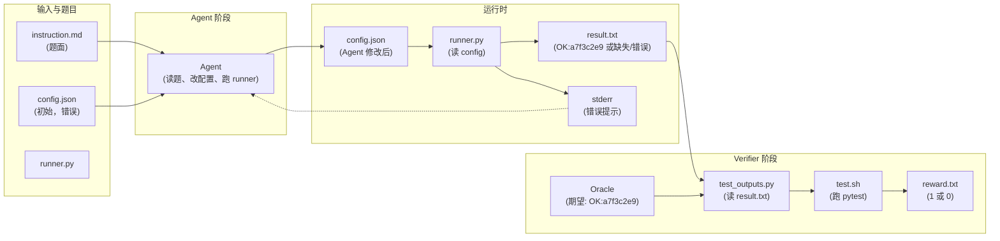
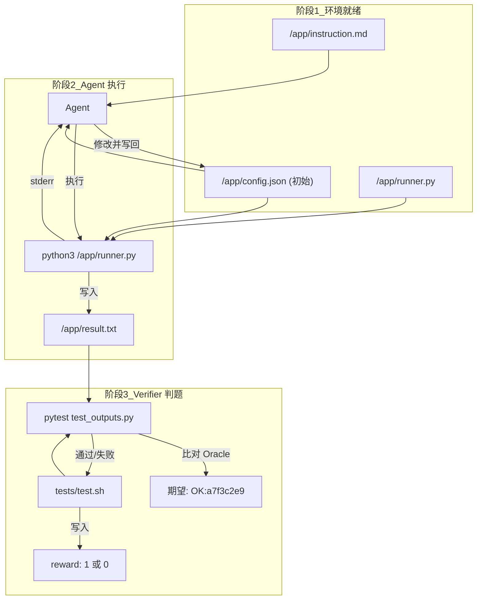
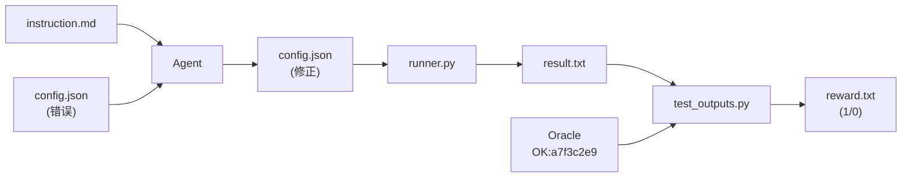
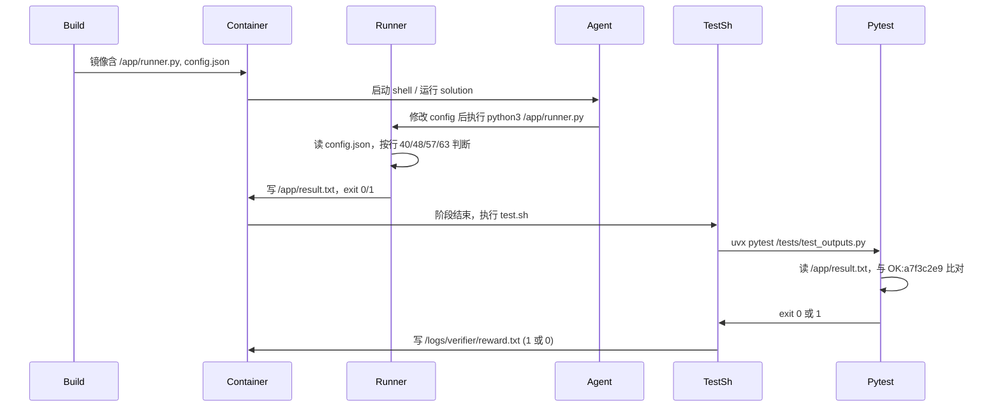

# exploration-oracle-demo 数据流图

## 1. 整体数据流（环境内）



## 2. 按阶段划分的数据流



## 3. 数据存储与读写关系

| 数据 | 路径 | 读 | 写 | 说明 |
|------|------|----|----|------|
| 题面 | instruction.md | Agent | (题目提供) | 描述目标与约束 |
| 配置 | /app/config.json | runner.py, Agent | Agent, solution | 初始错误，需改为正确四项 |
| 程序 | /app/runner.py | (执行) | - | 读 config，写 result.txt / stderr |
| 结果 | /app/result.txt | test_outputs.py | runner.py | 正确时为 `OK:a7f3c2e9` |
| Oracle | (代码常量) | test_outputs.py | - | EXPECTED_LINE = "OK:a7f3c2e9" |
| 判题结果 | /logs/verifier/reward.txt | Harbor | test.sh | 1=通过，0=未通过 |

## 4. 简化数据流（端到端）



一句话：**题面 + 初始 config → Agent 修改 config 并跑 runner → result.txt → Verifier 与 Oracle 比对 → reward.txt**。

---

## 5. 执行顺序（按时间线）

整体分三阶段：**环境构建 → Agent/解题阶段 → Verifier 判题**。

### 阶段一：环境构建（Build）

| 顺序 | 动作 | 涉及文件/命令 |
|------|------|----------------|
| 1 | 根据 `environment/Dockerfile` 构建镜像 | `Dockerfile` |
| 2 | 将 `environment/runner.py`、`environment/config.json` 拷贝到镜像内 `/app/` | `COPY runner.py config.json /app/` |
| 3 | 设置容器默认命令为 `python3 /app/runner.py` | `CMD` |

此时镜像内已有：`/app/runner.py`、`/app/config.json`（初始错误值）。

---

### 阶段二：Agent / 解题阶段（Run）

容器启动后，由 **Agent** 或 **Oracle 标准解** 执行。执行顺序如下：

| 顺序 | 动作 | 涉及文件 |
|------|------|----------|
| 1 | 读题面 | `instruction.md`（由框架注入或挂载） |
| 2 | （可选）读当前配置 | `/app/config.json` |
| 3 | （可选）读程序源码 | `/app/runner.py` ← 导致答案泄露 |
| 4 | 修改配置并写回 | 写 `/app/config.json` |
| 5 | **执行 runner** | 运行 `python3 /app/runner.py` |
| 6 | runner 内部顺序 | 见下方「runner.py 内部执行顺序」 |
| 7 | 得到判题输入 | `/app/result.txt`（及 stderr、退出码） |

**若用 Oracle 标准解**：直接执行 `solution/solve.sh`，其内部顺序为：写正确 `config.json` → 执行 `python3 /app/runner.py`。

#### runner.py 内部执行顺序

```
1. 读 /app/config.json
2. 取 algorithm, tolerance, max_iter, output_mode
3. 第 40 行：若 algorithm != "bisect" → stderr + exit 1
4. 第 46–51 行：若 tolerance 非 (0,1] 内浮点数 → stderr + exit 1
5. 第 54–60 行：若 max_iter 非 ≥10 整数 → stderr + exit 1
6. 第 63–65 行：若 output_mode != "checksum" → stderr + exit 1
7. 全部通过 → 写 /app/result.txt "OK:a7f3c2e9\n"，stderr "Success"，exit 0
```

---

### 阶段三：Verifier 判题（Verify）

Agent 阶段结束后，框架运行 Verifier，顺序如下：

| 顺序 | 动作 | 涉及文件/命令 |
|------|------|----------------|
| 1 | 执行 `tests/test.sh` | `test.sh` |
| 2 | test.sh 内：安装 uv、pytest 等 | （环境准备） |
| 3 | 运行 pytest：`pytest ... /tests/test_outputs.py` | `test_outputs.py` |
| 4 | test_outputs.py：检查 `/app/result.txt` 是否存在 | `test_result_file_exists` |
| 5 | test_outputs.py：读 result.txt，与 `EXPECTED_LINE`（OK:a7f3c2e9）比对 | `test_result_matches_oracle` |
| 6 | test.sh 根据 pytest 退出码写 reward | 成功 → `echo 1 > /logs/verifier/reward.txt`，失败 → `echo 0` |

---

### 时序概览（Mermaid）



**一句话**：**构建 → Agent 改 config 并跑 runner.py → runner 写 result.txt → test.sh 调 pytest 读 result.txt 比对 Oracle → 写 reward.txt**。

---

## 6. 在终端执行 runner.py

可以。但 `runner.py` 写死了路径 **`/app/config.json`** 和 **`/app/result.txt`**，所以要在「有 `/app`」的环境里跑。

### 方式一：Docker（与题目环境一致，推荐）

```bash
cd exploration-oracle-demo
docker build -f environment/Dockerfile -t demo environment/
docker run --rm demo
```

默认会执行 `python3 /app/runner.py`。当前 config 错误时会报错并 exit 1；改对后会在容器内写 `/app/result.txt`。

### 方式二：本地临时目录（不改 runner 源码）

在项目里建一个 `app` 目录，把 `environment/config.json`（和 runner）放进去，用环境变量把「/app」指到这个目录再跑（例如用一行 `python3 -c "..."` 里替换路径后 `exec` 执行 runner 逻辑），即可在终端看到同样行为：读 config、打 stderr、成功时写 result.txt。

示例（在 `exploration-oracle-demo` 目录下，且已存在 `app/config.json`）：

```bash
cd exploration-oracle-demo
mkdir -p app && cp environment/config.json app/
APP_DIR="$(pwd)/app" python3 -c "
import os
app = os.environ.get('APP_DIR', 'app')
code = open('environment/runner.py').read()
code = code.replace('Path(\"/app/config.json\")', 'Path(app + \"/config.json\")')
code = code.replace('Path(\"/app/result.txt\")', 'Path(app + \"/result.txt\")')
exec(compile(code, 'runner.py', 'exec'))
"
```

- 当前 config 错误时会打印 `ERROR: ...` 到 stderr 并退出码 1。
- 若把 `app/config.json` 改为正确四项后再跑，会得到 `app/result.txt` 内容 `OK:a7f3c2e9`。

---

## 7. 本地一次跑完 Oracle + Verifier

镜像内仅含 `runner.pyc`（无 `runner.py` 源码）。在题目目录下先建 `logs/verifier`，再挂载 solution、tests、logs，容器内先跑 oracle 再跑 verifier，最后在宿主机看 reward：

```bash
cd exploration-oracle-demo
mkdir -p logs/verifier
docker run --rm \
  -v "$(pwd)/solution/solve.sh:/solution.sh" \
  -v "$(pwd)/tests:/tests" \
  -v "$(pwd)/logs:/logs" \
  exploration-oracle-demo:latest \
  bash -c "bash /solution.sh && bash /tests/test.sh"
```

- 成功时：pytest 2 passed，`logs/verifier/reward.txt` 为 `1`。
- 失败时：pytest 报错，`reward.txt` 为 `0`。
